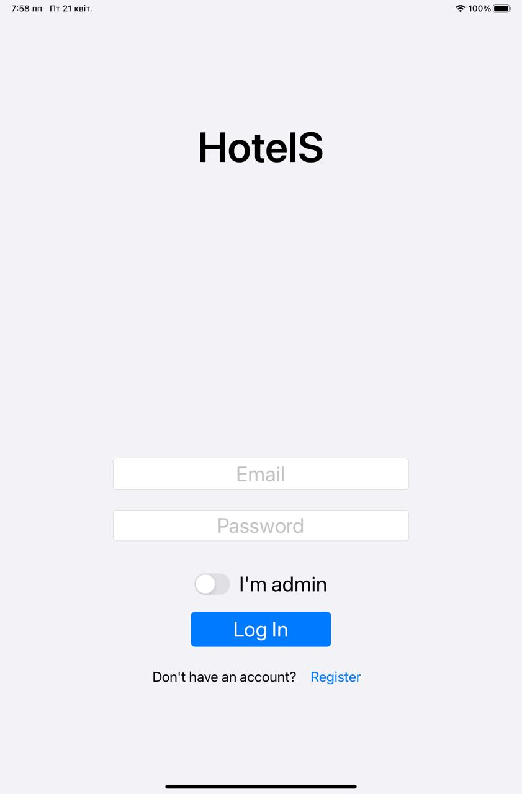

    

<h1 align="center">HotelS</h1>

An iOS application for ordering services in hotels.

## Features

HotelS provides guests the ability to access hotel services without the need of directly communicating to stuff. App supports creating and editing services in different categories, making orders with the ability to choose delivery time, tracking orders in real time, changing order status, tracking room's bill etc.

## Technologies used
App is written in Swift using MVC architecture. UI is built using UIKit with Storyboard. Backend is based on Firebase Firestore and Firebase Authentication. App uses SDWebImage for image loading with cache support. Third party libraries were added using Swift Package Manager.

## Screenshots

    

    

    

